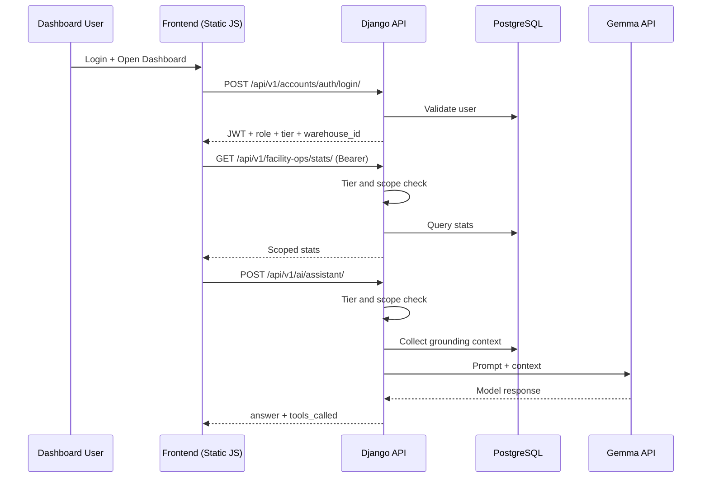
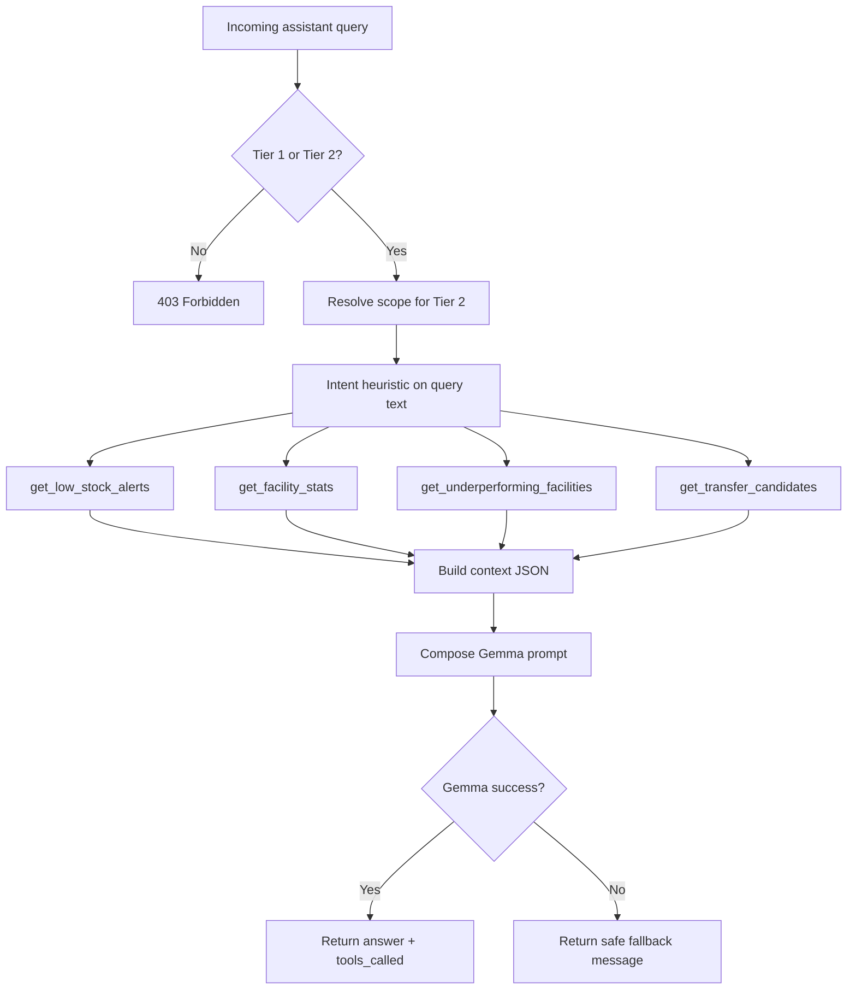

# AI Implementation Flow and System Flow (Detailed)

This document explains how the current AfyaSync implementation works end-to-end.

## 1. High-level architecture

Primary backend components:

- Django + DRF API (authentication, UAC, facility operations, analytics)
- AI integration app (Gemma text and vision workflows)
- PostgreSQL as source of truth
- Optional Celery/Redis layer (not required to run core API at this stage)

Primary frontend components:

- Static dashboards per tier
- Shared design system (tokens/base/components)
- Shared API client and auth handling

## 2. Access control model (UAC)

### 2.1 Tier definitions

- Tier 1: ADMIN
- Tier 2: BRANCH_MANAGER, WAREHOUSE, PROCUREMENT, CASHIER
- Tier 3 internal: REPORTER (read-only)
- Tier 3 external: X-API-Key clients for public endpoints only

### 2.2 Scope enforcement

Tier-2 users are facility-scoped:

1. Resolve user profile warehouse via WorkerProfile.warehouse
2. If missing, fallback to first warehouse in WorkerProfile.branch
3. Inject/validate warehouse context in endpoints
4. Block cross-facility attempts with 403

This enforcement is server-side, not dependent on frontend behavior.

## 3. Authentication flow

### 3.1 Internal users (JWT)

1. Frontend submits email/password to /api/v1/accounts/auth/login/
2. Backend validates credentials
3. Backend returns access token, refresh token, and user payload (role, tier, warehouse_id)
4. Frontend stores tokens in sessionStorage
5. Frontend sends Bearer token on each API request

### 3.2 External integrators (public API key)

1. Client sends X-API-Key header to /api/v1/public/*
2. PublicAPIKeyAuth compares header with PUBLIC_API_KEY env value
3. If valid, request proceeds without internal user object
4. If invalid/missing, request is rejected

## 4. AI implementation flow

## 4.1 Shared AI principles

- Keep AI touchpoints focused and operational
- Use real DB-derived context as grounding
- Apply strict role and scope checks before AI execution
- Fail safely when model is unavailable
- Cache repeat-heavy responses (forecast, redistribution)

## 4.2 Assistant endpoint flow

Endpoint: POST /api/v1/ai/assistant/

Execution sequence:

1. Permission gate: must be Tier 1 or Tier 2
2. Parse query from request body
3. If Tier 2, resolve scoped warehouse
4. Intent heuristics choose tool set:
   - low stock queries -> get_low_stock_alerts
   - attendance/facility trend queries -> get_facility_stats (Tier 2 scoped)
   - underperformance queries -> get_underperforming_facilities (Tier 1)
   - transfer queries -> get_transfer_candidates (Tier 1)
5. Build context object from tool output
6. Compose prompt with user query + context JSON
7. Call Gemma text model
8. Return answer + tools_called + context for transparency
9. If model call fails, return safe fallback message

## 4.3 OCR intake flow

Endpoint: POST /api/v1/ai/ocr-intake/

Execution sequence:

1. Permission gate: Tier 1 or Tier 2
2. For Tier 2, enforce facility assignment
3. Validate image upload (multipart/form-data)
4. Build structured extraction prompt requiring strict JSON schema
5. Send image + prompt to Gemma vision model
6. Parse JSON response
7. Return extracted fields + confidence note + requires_confirmation
8. If vision call fails, return manual-confirmation fallback payload

Safety behavior:

- No auto-write of extracted values to inventory in this step
- Human confirmation remains mandatory before business updates

## 4.4 Forecast flow

Endpoint: GET /api/v1/ai/forecast/<warehouse_id>/<product_id>/

Execution sequence:

1. Permission gate: Tier 1 or Tier 2
2. Tier 2 can only request own warehouse
3. Check cache key gemma:forecast:<warehouse>:<product>
4. If cache miss:
   - Calculate local forecast from inventory + recent facility stats
   - Build recommendation prompt for Gemma
   - If Gemma responds, use model recommendation text
   - If Gemma fails, keep deterministic local recommendation
5. Save response in cache with GEMMA_CACHE_TTL_SECONDS
6. Return forecast object

## 4.5 Redistribution suggestion flow

Endpoint: GET /api/v1/ai/redistribution-suggestions/

Execution sequence:

1. Permission gate: Tier 1 only
2. Check cache key gemma:redistribution:suggestions
3. If cache miss:
   - Pull low-stock products
   - Build transfer candidates from inventory surpluses and shortages
   - Return product, source facility, destination facility, quantity, reasoning
4. Cache response

Current implementation is intentionally simple and explainable for demo reliability.

## 4.6 Public API data isolation

Public endpoints never call Gemma and never expose sensitive inventory detail:

- /api/v1/public/facilities/
- /api/v1/public/alerts/
- /api/v1/public/facility-stats/<id>/

This protects quota and controls data exposure.

## 5. System data flow by module

## 5.1 Facility Ops

Inputs:

- Staff-submitted daily stats (footfall, bed occupancy, doctor attendance)
- Task-generated underperformance alerts

Outputs:

- Facility dashboard cards
- Alerts feeds
- AI grounding context

## 5.2 Products and Inventory

Inputs:

- Existing stock levels by product and warehouse

Outputs:

- Low-stock detection
- Forecast base signals
- Redistribution candidate generation

## 5.3 Analytics

Inputs:

- Real-time inventory alerts

Outputs:

- Tier-aware alerts endpoint
- Additional context for assistant/public alerts aggregation

## 6. Request sequence diagrams

### 6.1 Internal dashboard API call flow

### 6.2 Assistant internal decision flow

## 7. Failure and fallback behavior

## 7.1 Gemma unavailable

Behavior:

- Assistant returns a clear fallback response
- Forecast still returns deterministic local computation
- OCR returns manual-confirmation placeholder output

Impact:

- Core dashboard remains usable even when AI is unavailable

## 7.2 Missing Tier-2 warehouse assignment

Behavior:

- Tier-2 write or AI scope-dependent requests return validation error
- Prevents accidental cross-facility leakage

## 7.3 Database or migration mismatch

Behavior:

- API endpoints fail fast with explicit errors
- Deployment guide requires migrate + check before service restart

## 8. Security and exposure boundaries

- JWT required for all internal endpoints
- API key required for all public endpoints
- Public API only exposes curated, read-only aggregates
- Tier-2 data paths are backend-enforced
- Non-API domain paths can be blocked at nginx level for backend-only host

## 9. Performance and quota controls

- Forecast and redistribution endpoints use cache TTL to reduce repeated model calls
- Reporter and public API do not consume Gemma quota
- Local deterministic fallback minimizes hard dependency on model calls

## 10. Operational notes for current stage

- Redis/Celery are optional for core API runtime
- Start only:
  - PostgreSQL
  - Gunicorn systemd service
  - nginx
- Add Redis/Celery later when scheduled jobs and async pipelines become mandatory
